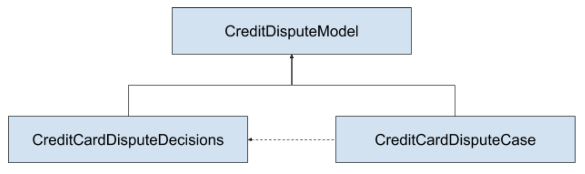

# KIE Components for the FSI Credit Dispute demo app

## Projects

This is a collection of KIE projects with following relationship:

* Both the decisions project and case project have a direct Maven dependency on the model
* The Case project remotely invokes the decisions using a work item handler defined in the deployment descriptor using the maven coordinates of the decisions project
  * Can add a scanner as a fourth parameter expressed in ms
  * The FraudDispute process uses the new Decision Task
  * The decisions project includes the LocalDMNProcess that illustrates a local DMN invocation

## Domain Objects

* Cardholder
  * age:integer
  * balanceRatio: Float
  * incidentCount: integer
  * stateCode: String
  * status: String (GOLD|SILVER|STANDARD)
* FraudData
  * automated: boolean
  * customerStatus: String (GOLD|SILVER|STANDARD)
  * lineItemCount: Integer
  * maxDaysElapsed: Integer
  * totalFraudAmount: Float
* AdditionalInformation
  * questionId: Integer
  * questionPrompt: String
  * questionType: String (text,boolean,date,number)
  * answerValue: String
